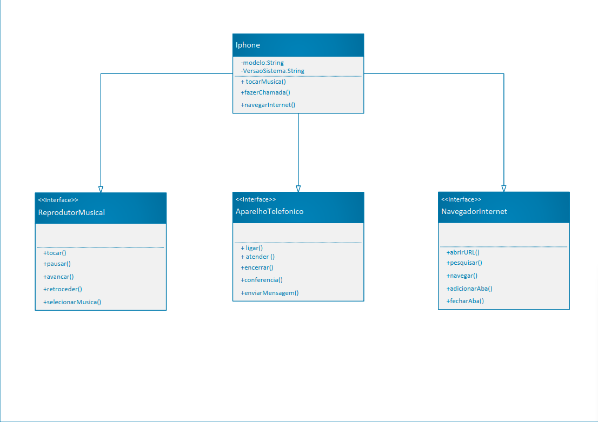
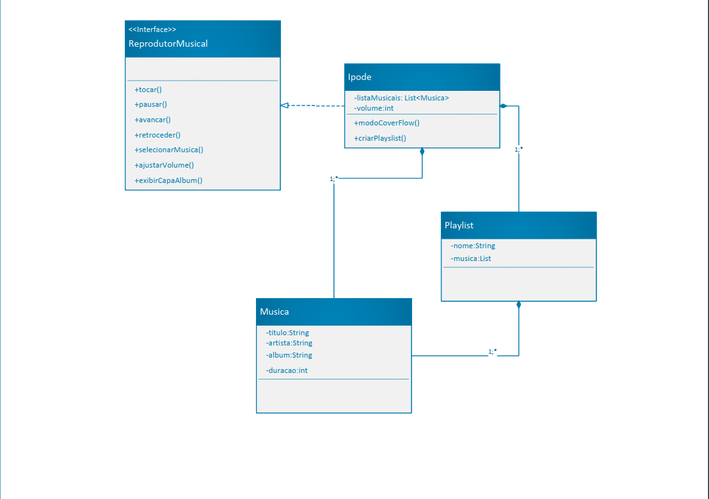
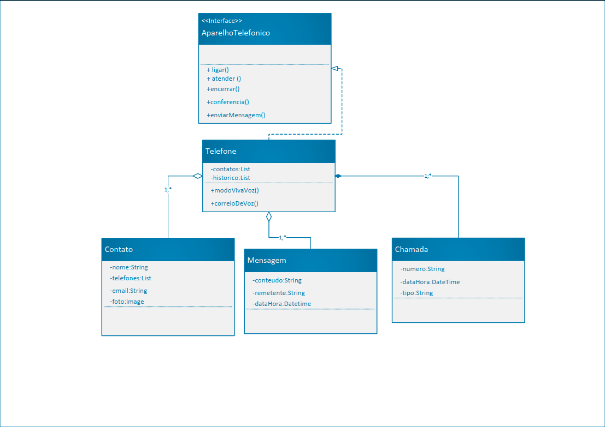
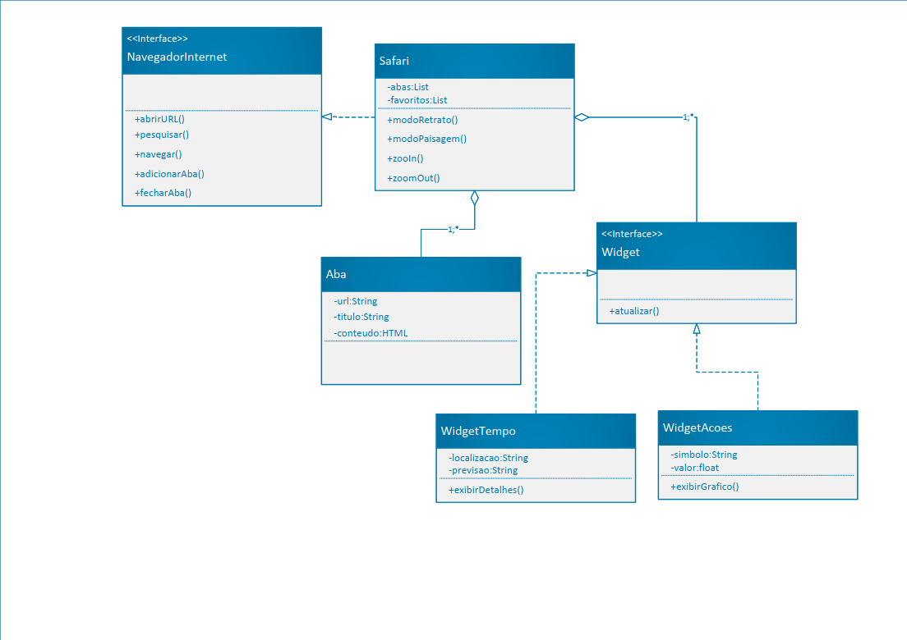

# UML_IPHONE_MODELAGEM
elabore em uma ferramenta de UML de sua preferência. A diagramação das classes e interfaces com a proposta de representar os papéis do iPhone de: Reprodutor Musical, Aparelho Telefônico e Navegador na Internet. Em seguida crie as classes e interfaces no formato de arquivos .java

  
  
  

